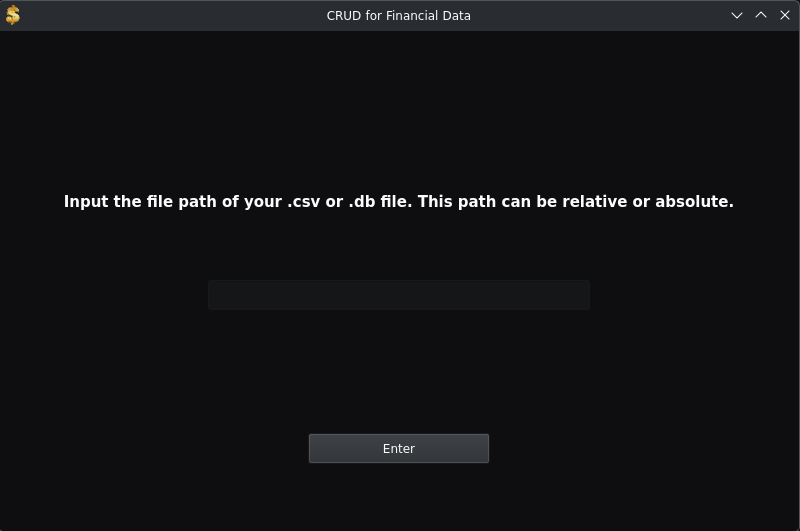
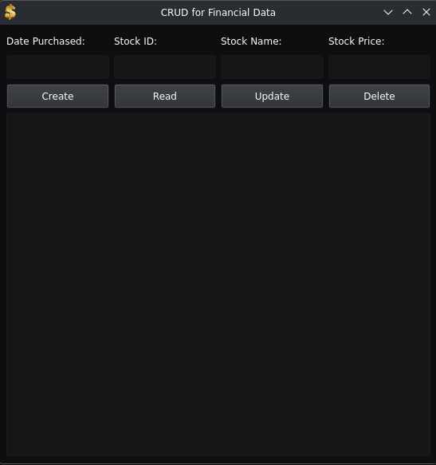
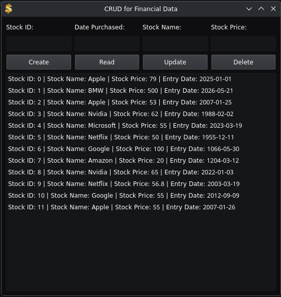
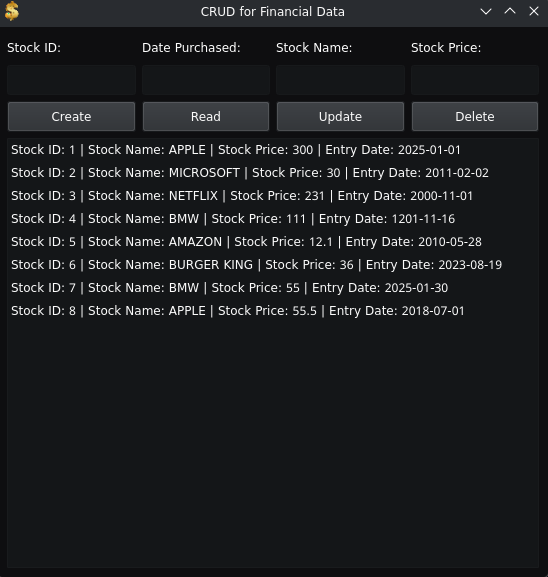

## Professional Self Assessment

Throughout my time in the Computer Science program at Southern New Hampshire University (SNHU), I have gained valuable skills, knowledge, and experience in many aspects of Computer Science, including, but not limited to, Software Testing, Software Automation, Quality Assurance, Software Security, Object-Oriented Programming, Software Engineering, Software Design, Databases (including relational databases like MySQL and SQLite, and non-relational databases like MongoDB), Computer Graphics and Visualization with software like OpenGL, Data Structures, and Algorithms. 

My coursework throughout the Computer Science program has certainly strengthened my Computer Science skills, shaped my professional goals and values, and prepared me to enter the Computer Science field. Moreover, many of my projects involved addressing fictional client needs and occasionally working on pre-established codebases; this extensively prepared me for collaborating in a team environment and working with stakeholders.
* For example, my CS-320 course’s final project, which I worked on throughout multiple weeks, involved creating thorough JUnit tests for a mobile application that achieved 90%+ code coverage across all files and thoroughly tested many possible scenarios. This strengthened my Java, Software Engineering, and Software Security skills, and led me to realize the vast importance of thoroughly testing software to ensure that it meets all its required functionality and doesn’t break when presented with certain input. 
* Furthermore, in my CS-340 Client/Server Development Course, I created a dashboard for a fictional company called Grazioso Salvare. This dashboard displays plotly graphs, maps, and data tables with information about animals (primarily cats and dogs) across the U.S. The data is provided by a MongoDB backend that is managed by a custom-made CRUD Python module that uses PyMongo to communicate with MongoDB. By completing this project, I significantly strengthened my Python, Databases, and Software Engineering skills. 

As part of the CS-499 course, I had to add three enhancements to a past project(s) I had completed in the categories of Software Engineering and Design, Data Structures and Algorithms, and Databases. For all three enhancements, I selected my final project from my CS-300 Data Structures and Algorithms course, a C++ project designed to read a .csv input file containing data about a University’s courses into a HashTable and read specific courses from the HashTable, list all courses in the HashTable, and view prerequisites for specific courses. I chose to enhance this artifact in all three categories because it was a moderately advanced project with strong potential for improvement in all three categories. In Software Engineering and Design, it started with a notably weak folder and file structure, as well as the program operating entirely in the CLI, which meant that I could significantly improve it by enhancing the folder and file structure and moving the program out of the CLI. In the Data Structures and Algorithms section, it already had a strong base, but I could significantly improve it by adding full CRUD functionality. In the databases section, there was a significant amount of work to be done, as there wasn’t any database implementation in the initial project; however, since the project revolved around accessing data from a file, it was definitely suitable for a Databases enhancement. Moreover, I wanted to focus on creating a larger-scale project that would require a significant amount of work over multiple months. 

## Course Outcomes

Through the enhancements to my project, I fully achieved all of the following course outcomes:

* Employ strategies for building collaborative environments that enable diverse audiences to support organizational decision making in the field of computer science.
* Design, develop, and deliver professional-quality oral, written, and visual communications that are coherent, technically sound, and appropriately adapted to specific audiences and contexts.
* Design and evaluate computing solutions that solve a given problem using algorithmic principles and computer science practices and standards appropriate to its solution, while managing the trade-offs involved in design choices
* Demonstrate an ability to use well-founded and innovative techniques, skills, and tools in computing practices for the purpose of implementing computer solutions that deliver value and accomplish industry-specific goals.
* Develop a security mindset that anticipates adversarial exploits in software architecture and designs to expose potential vulnerabilities, mitigate design flaws, and ensure privacy and enhanced security of data and resources.

Note that the outcome "Design, develop, and deliver professional-quality oral, written, and visual communications that are coherent, technically sound, and appropriately adapted to specific audiences and contexts." is met throughout all the enhancements, in the changelog, in the readme, in the code review, and on this website. I deliberately have chosen not to assign its completion to one specific enhancement because it is something I achieved throughout this entire course.

## Code Review

<video src="assets/code_review.mp4" width="100%" controls></video>

## Enhancement One: Software Engineering and Design

The artifact is my final project for CS-300: Data Structures & Algorithms: Analysis and Design. It was created on the 14th of April, 2026. I selected this artifact because it was very limited in terms of Software Engineering and Design elements: it lacked a proper folder structure, multiple distinct files, a proper GUI, had many security issues, and wasn’t very maintainable or readable. This presented me with the opportunity to significantly improve the artifact. I improved this artifact by adding a proper folder structure, a changelog, a readme, a qmake .pro file that easily builds the program, and files to set the stage for future enhancements. Moreover, I also added a GUI in Qt with three separate windows, one for selecting a file, one for .db files, and one for .csv files. Throughout the process of enhancing and modifying this artifact, I learnt a lot about Qt and qmake. I’ve worked with other GUI libraries before, but using Qt was a new experience for me; learning to use Qt Designer - a UI creation menu - was certainly a challenge. Moreover, I also learnt how larger-scale projects may choose to structure their folders, files, and documentation. Until now, I’d only worked on relatively small projects, so having the opportunity to work on a somewhat larger project that necessitates a more complex structure was definitely interesting. However, on a similar note, one challenge I faced was having to change my initial folder structure plan. Originally, I wanted to use just a src and a res folder, but over time, this expanded to src, ui, build, bin, inc, and ui folders, as well as a few additional files, such as qmake’s .pro file. 

### The course outcomes I met in this project are:

* Employ strategies for building collaborative environments that enable diverse audiences to support organizational decision-making in the field of computer science.  
* Demonstrate an ability to use well-founded and innovative techniques, skills, and tools in computing practices for the purpose of implementing computer solutions that deliver value and accomplish industry-specific goals.

## Enhancement Two: Data Structures and Algorithms

The artifact I selected is my final project for CS-330. It was created on the 14th of April, 2026. I selected this artifact because it is something that already uses data structures and algorithms, but also has many areas where I could add more data structures and algorithms. Most notably, this artifact only implements the Read segment of CRUD, so I had the opportunity to implement data structures and algorithms for Create, Update, and Delete. I improved this artifact by adding full CRUD functionality for .csv files that can be accessed via a Qt GUI. In this artifact, I ended up using significantly more data structures and algorithms than I originally expected. This is because I had to create algorithms to translate between C++ components and variables and their Qt counterparts, which presented many challenges. For instance, in the Read function, my C++ CSVprocessor class returns a vector, but Qt doesn’t understand vectors, nor does it understand strings or std::time_t. So, I had to write an algorithm to convert all stocks in the vector into a QStringList, which is then passed into a QStringListModel, which is then passed into the ListView in the CSVwindow UI. Ultimately, this taught me a lot about Qt and how to use it with C++ as well as how to use data structures and algorithms to facilitate communication between them. The pure CRUD areas (i.e., not trying to make something function with Qt) inside CSVprocessor.cpp didn’t present any major challenges, but there are definitely still some areas I can refine.

## Enhancement Three: Databases

The artifact I’ve selected is my final project for CS-330. It was created on the 14th of April, 2026. I selected this artifact because it’s designed to perform read operations on a .csv file, and has the potential to expand to other CRUD operations as well as other file types and databases. I improved the artifact by adding full CRUD functionality for .db (SQLite) files with secure parameterized queries. Moreover, all these CRUD operations could be accessed via the previously built Qt GUI. While enhancing and modifying this artifact, I learnt a lot about using the sqlite3 library, more specifically, how to use it to create parameterized queries for CRUD operations and how to use it to validate the integrity of certain .db files. Using the sqlite3 library certainly presented challenges in creating optimal queries for each of the operations, understanding how to use the sqlite3 functions, and combining sqlite3’s C structure with my C++ project. Additionally, I learnt how to connect these queries to the Qt GUI, with buttons that enable the user to easily perform each of the CRUD operations. However, unlike the other enhancements, this enhancement is almost entirely complete and will only require some very minor changes, such as minor bug fixes and ease-of-use changes, before it is ready for the final portfolio.

